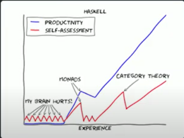
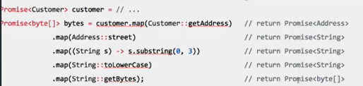

# Monad (모나드)
지난 시간 합성을 어떻게든 해보자는 느낌 정도였던 모나드! 자세히 공부해보자~~   

<br/>

## 모나드를 이해해야하는 이유
- 하스켈의 학습곡선
    생산성과 스스로에 대한 평가   
    

## Monad
- `값을 담는 컨테이너`의 일종
- `Functor` 기반 구현
- `flatMap()` 메소드 제공
- `Monad Laws`를 만족시키는 구현체
- Monad 종류
    - 많은 타입이 flatMap과 for comprehention을 활용할 수 있는 monad 혹은 monadic type으로 제공
        - Monadic이란 monad의 법칙을 모두 만족시키지는 못하지만 그럼에도 monad스럽게 사용할 수 있는 거   
        - (강의에서 Scala에서는 만족하지 않아도 Monad로 동작하여 똑같이 사용할 수 있다고 언급)
            ##### ex) Option[T], Try[T], List[T], Future[T]   
            ##### Future나 Try는 결합법칙 만족 X -> pure Monad X, Monadic
        - flatMap 함수가 있다면 Monad type 친구들이라 생각

## Monad가 필요한 이유 ( 값을 담는 컨테이너?!? )
- 비동기 연산을 처리할 때 사용할 수 있다   
**promise** = `Monad`
- Null 처리   
**Optional** = `Monad`

## Functor
-  Functor의 정의   
   
    1. 함수를 인자로 받는 `map` 메소드만 가진다
    2. 타입 인자 `< T >`를 가진다 - Functor< T >라 함은 T라는 값을 담는 컨테이터
    3. 전달인자인 `함수 f`는 `< T >` 타입 값을 받아 `< R >` 타입 값을 반환하는 함수
    4. Functor는 map함수를 거쳐 `< R > 타입의 Functor 반환`
- 쓰는 이유
    1. `일반적으로 모델링할 수 없는 상황`을 모델링할 수 있다!!   
        ##### ex1) 값이 없을 때 - null인 경우에는 그냥 로직이 실행되지 않고 null check가 불필요 -> 타입안정성 유지, null 인코딩   
        ##### ex2) 값이 미래에 준비될 것으로 예상될 때 - 비동기 연산들의 합성이 가능(동기인것마냥), return되는 값들이 non-blocking을 의미   
        ###### - Non-block : 호출된 함수가 자신이 할 일을 채 마치지 않았더라도 바로 제어권을 건네주어(return) 호출한 함수가 다른 일을 진행할 수 있도록 해줌
           
    2. 함수들을 쉽게 `합성`할 수 있다!
- List도 일종의 Functor ( Functor가 담고 있는 값이 List인 것!)

> 그러면 Monad는 뭐? Functor에 `flatMap()`을 추가한 것!

- Functor의 문제점   
    
`Functor`가 `Functor`에 감싸져 있으면, 함수의 합성과 체이닝을 저해한다, 반환값이 `Functor`인 함수는 매우 일반적 -> FlatMap 도입!!

## 묶인 것을 풀어주는 (모나드에 소속된) 연산
- FlatMap
- for comprehension

## FlatMap
- Map   
진정한 의미 : < T >타입의 Functor를 < R > 타입의 Functor로 바꾸는 기능   
    
- FlatMap   
Array나 Object로 감싸져있는 모든 원소를 단일 원소 스트링으로 반환해준다   
   
flat하게 만들어 주는 구나 -> 이해하긴 좋지만 모나드를 이해하기 어려워질 수 있음 ㅠㅠ   
   
-> < T >타입의 Functor를 타입인자 M로 바꾸는 기능

## for comprehension
- flatMap으로 구현된 코드의 callback 패턴들을 줄일 수 있다
    - flatMap
        ```
        // flatMap을 이용한 3개의 future를 compostion해서 결과를 얻을 수 있습니다.

        val itemsFuture : Future[List[Item]] =
            getUser(user_session).flatMap { case user =>
            getOrder(user.id).flatMap { case order =>
            getOrderItems(order.id)
            }
        }
        itemsFuture.foreach { items =>
            println(s"## User Order Items : ${items}")
        }
        ```
    - for comprehension
        ```
        // for comprehension을 이용하여 callback을 사용하지 않고 3개의 함수를 합성하였다.
        val itemsFuture : Future[List[Item]] = for {
            user <- getUserId(user_session)
            order <- getOrder(user.id)
            items <- getOrderItems(order.id)
        } yield items

        itemsFuture.map { items =>
            println(s"## User Order Items : ${items}")
        }
        ```

## Monad Laws

- Monad는 어떤 값을 감싸는 Wrapper인데, 그 중에서도 위의 3개의 Laws를 만족해야만 한다

## 결론 (의의)
- 일반적으로 할 수 없는 여러 상황을 모델링할 수 있다
- `비동기 로직`을 동기 로직을 구현하는 것과 동일한 형태로 구현하면서도, `함수의 합성 및 완전한 non-blocking pipeline`을 구현할 수 있다

<br/>

### 추가 정리   
###### 아직 scala가 미숙해서 추가   
- <-는 주로 for문에 사용된다
- println, printf   
    - 문자열 앞에 `s`를 쓰면 `$`를 쓰고 변수이름을 바로 쓸 수 있다
    - 수식을 입력하고 싶으면 `${ }`사이에 식을 넣는다
    - `java.lang.*`은 자동으로 import된다     
        ##### ex) printf("Pi is %f",Math.PI)
    ```
    def foo(n: Int, v: Int) =
        for (i <- 0 until n;
                j <- 0 until n if i + j == v)
        yield (i, j)

    foo(10, 10) foreach {
        case (i, j) =>
            println(s"($i, $j) ")  // prints (1, 9) (2, 8) (3, 7) (4, 6) (5, 5) (6, 4) (7, 3) (8, 2) (9, 1)
    }
    ```
- Scala 임포트 구문의 또 한가지 특징은 패키지나 클래스에 속한 모든 이름들을 불러 올 경우 별표(*) 대신 **밑줄(_)** 을 사용 한다

<br/>
<hr/>

## Reference
[모나드란 무엇인가](https://www.youtube.com/watch?v=jI4aMyqvpfQ&list=WL&index=1)  
[Monad in scala](https://wingnim.tistory.com/106)   
[for comprehension](https://docs.scala-lang.org/tour/for-comprehensions.html) 
[Scala Study](https://programmers.co.kr/learn/courses/12/lessons/604)

[](https://hamait.tistory.com/763)
