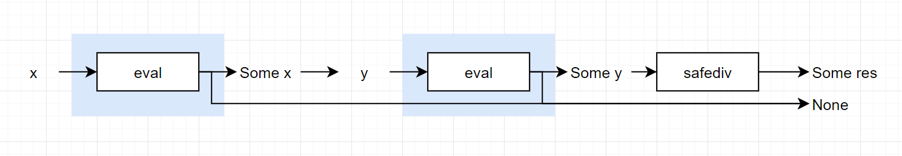

# 모나드 Monad

> A Monoid in the Category of Endofunctors

⚠이하 본문은 `제네릭 프로그래밍`, `대수적 자료형`, `패턴 매칭` 을 알고 있음을 전제 하에 기술되었습니다.

---
## 모노이드 monoid
항등원을 갖는, 결합 법칙을 따르는 이항 연산을 갖춘 `대수 구조`
>### 대수 구조 algebraic structure
>일련의 연산들이 주어진 집합
>대수 구조의 signature (T,arity) 는 arity:T->N  
>이때 arity(α) = n 인 α ∈ T 를 `T의 n항 연산`이라 함.


>너무 깊다! 그래서 모나드가 뭐냐!
---
## 프로그래밍에서의 모나드
[reference](https://overcurried.com/3%EB%B6%84%20%EB%AA%A8%EB%82%98%EB%93%9C/)

타입 `M`에 대해서 `pure function`과 `compose function`을 가지고 있으면 `M`은 모나드이다.

```scala
type Pure = <A>(a:A) => M<A>
type Compose = <A,B,C>(f:(a:A)=>M<B>,g:(a:B)=>M<C>)=>(a:A) => M<C>
```
---

## Monad의 Scala 구현체
[reference](https://stackoverflow.com/a/25361305)

```scala
class Monad[A](value:A) {
    def map[B](f:A=>B) = new Monad(f(value))
    def flatMap[B](f:A=>Monad[B]) = f(value)
}
```
---

## Monad for Scala Newbies
[reference](https://medium.com/@vigneshwaranr/monad-for-scala-newbies-9e8a12f2112b)

`Integer` 타입의 리스트에 대해서 짝수인 요소들의 제곱의 합만 구한다고 할때,  
`java` 에서는 다음과 같이 짤 수 있을 것이다

```java
public int sumOfSquaresOfEvenElements(List<Integer> list){
    if(list == null)
        return 0;

    int acc = 0;

    for(int elment:list)
        if(element%2==0)
            acc+=(element*element);
    
    return acc;
}
```

이 몇줄 안되는 함수가 하는 일들은 다음과 같다.  

1. 리스트가 `null`인지 체크
2. `acc` 선언 및 `0`으로 초기화
3. 리스트 반복문
4. 리스트 내의 요소가 짝수인지 검사
5. 리스트 내의 요소 제곱
6. `acc`에 덧셈
7. `acc` 반환

이 모든 동작들이 엉켜져 있다: acc가 여러 라인에 걸쳐서 상태를 유지하고 있는 모습을 보라!

🤔뭔가 문제가 있어 보이지 않는가?
이를 스칼-라로 써보도록 하자

```scala
def sumOfSquaresOfEvenElements(list:List[Int]):Int= {
    Option(list)
    .toList
    .flatten
    .filter(_%2==0)
    .map(x=>x*x)
    .sum
}
```

위의 코드를 풀이하자면 다음과 같다.
1. 주어진 list를 `Option 모나드` 로 승급했다. 
   - 만약 list가 null이 아니라면 `Some(value)` 가 될 것이고
   - list가 null이라면 `None`이 될 것이다.
>Scala에서는 null을 직접 다룰 일이 없지만, JAVA에서 scala 코드를 호출한다면 null 검사를 하는 것을 권장한다.  
>위의 함수가 scala에서만 호출된다면 Option으로 감싸는 단계는 생략할 수 있다.

2. 우리가 실질적으로 필요한 값은 `List 모나드` 이기 때문에, Some(value)=>List(value)로 변환한다. 이 때 타입 시그니쳐는 `List[List[Int]]` 이다
> ❓ 굳이 list로 감싸는 이유는 솔직히 모르겠음. null-safe를 원했다면 `Option.getOrElse(List.empty)`를 쓰는게 정신건강에 이롭다.

3. `List 모나드`에 `filter`연산을 적용한다.
4. `List 모나드`에 `map` 연산을 적용한다.
5. `List 모나드`에 sum `reduce((a:Int,b:Int)=>a+b)`을 적용한다

Option 체크를 제외한 코드는 다음과 같다.
```scala
def sumOfSquaresOfEvenElements(list:List[Int]):Int ={
    list
    .filter(_%2==0)
    .map(x=>x*x)
    .sum
}
```
✨깔끔!

위의 예제를 통해 `Option 모나드`와 `List 모나드`에 다뤘다....!  
근데 아직도 모나드는 잘 모르겠다.

---

## Monad by Computerphille
[reference](https://www.youtube.com/watch?v=t1e8gqXLbsU&ab_channel=Computerphile)

수학의 집합론에서 1960년대에 기원했으며 1990년대 컴퓨터 프로그래밍에서 재발견된 것.

`사실`을 기반으로 프로그래밍을 하는 새로운 관점

나눗셈 연산을 하는 프로그램을 모나드로 구현(본문에서는 하스켈을 예시로 들었으나, 최대한 scala로 재작성해봄)  
가장 기본적인 데이터를 표현하는 방법에 대한 접근

|수학|Scala|
|---|---|
|1|`1:Float`|
|6/2|`Div(6:Float,2:Float)`|
|6/(3/1)|?|

위의 테이블 중 마지막 경우와 같이 표현할 수 있는 방법  

값을 평가하는 `eval` 이라는 함수를 정의  
`eval` 은 `Expr`을 받아서 `Float` 값을 계산  
```scala
sealed trait Expr
case class Val(value:Float) extends Expr
case class Div(x:Float,y:Float) extends Expr

def eval(x:Expr):Float = {
  x match {
    case Val(x)=> x
    case Div(x,y)=> x/y  
  }
}
```

그러나 위의 프로그램의 경우,  
나누기 연산의 우측 피연산자가 0일 경우 DivZero! 에 의해 죽을 수 있기 때문에 이에 대한 에러를 대응해야 한다.

```scala
def safeDiv(x:Float,y:Float):Option[Float] =
  if(y==0)    None
  else        Some(x/y)
```
이런 개념을 기반으로 `eval function` 을 재작성하면
```scala
def eval[Expr](expr:Expr):Option[Float] = {
  expr match {
    case Val(x)=> Some[Float](x)
    case Div(x,y)=>
      eval(x) match {
        case None => None
        case Some(xValue) =>
          eval(y) match {
            case None => None
            case Some(yValue)=>Some(xValue/yValue)
          }
      }
  }
}
```

이 프로그램은 백년만년 장수할 것이고, 문제 없이 돌아갈 것이다.  
근데 쓰기 너무 복잡하고 쓸 것도 많다!!😡

근데 위의 코드에서는 반복되는 구조가 보임
```scala
...
 eval(x) match {
        case None => None
        case Some(xValue) =>
...
eval(y) match {
            case None => None
            case Some(yValue)=>
...
```
위의 두 경우 모두 `None` 이 들어온 경우, `None`을 반환하고, `Some`일 경우에 뭔가를 수행하는 것!  
이를 추상화하면 다음과 같다
```scala
❓❓❓❓❓ match
    case None => None
    case Some x => ❔❔❔❔❔ x
```
위의 코드에서 ❓❓❓❓❓는 `Option` 타입이고, ❔❔❔❔❔는 `f(x:A)=>B` 타입이다  
따라서 우리가 원하는 그림은 다음과 같다



이 때의 시그니쳐는 다음과 같다

