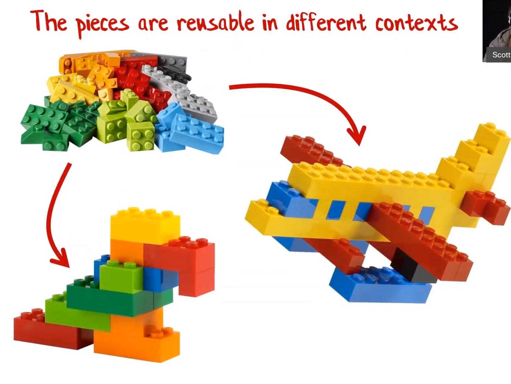
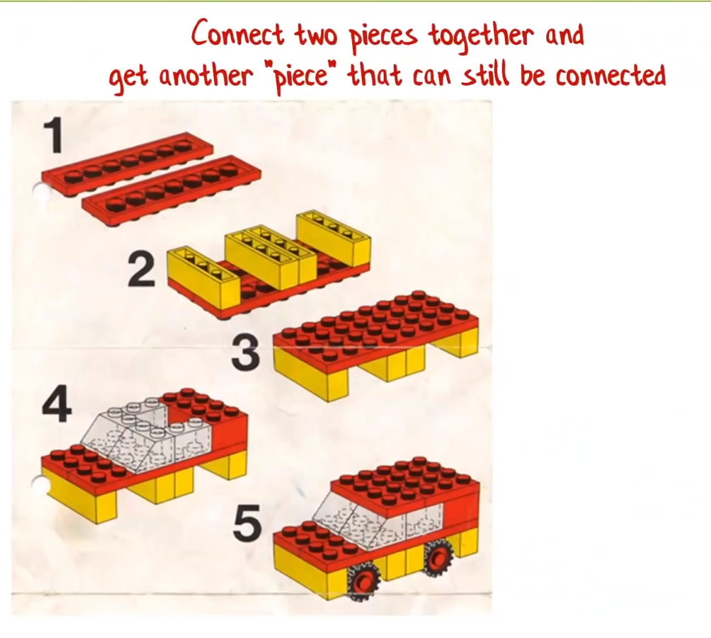

# The Power of Composition
[reference: the power of composition, NDC 2020, Scott Wlaschin](https://www.youtube.com/watch?v=rCKPgu4DvcE&ab_channel=NDCConferences)

## 합성을 알기 전에 사전 요구사항
- 어린 시절에 레고를 가지고 놀아 본 적이 있을 것
- 혹은 장난감 기차를 가지고 놀아 본 적이 있을 것

## 레고의 철학
1. 모든 부품들은 합체하기 위해 설계됨
2. 부품들은 많은 상황에서 재사용 될 수 있음
3. 두 부품이 합쳐지면 추가로 합칠 수 있는 새 부품이 생김



각각의 레고 블럭간에는 어떠한 제약 사항도 없기 때문에 온전히 재사용이 가능하다.  
프로그래밍의 관점에서는 온전히 재사용 가능한 프로그램을 만드는 것을 지향해야 함  
이런 맥락에서 method(class 등에서의)는 상당히 어울리지 않는 요소  



레고에서 작은 부품들로 큰 부품을 만드는 예시. 두 조각을 합지고 나서 계속 합칠 수 있다.

```fsharp
🍏 -> 🍌 //인 함수 A와
🍌 -> 🍅 //인 함수 B가 있을 때

//A 와 B를 합쳐서
🍏 -> 🍅 //인 함수 C를 만들 수 있다
//ㄴ 여기서 아무도 바나나의 존재를 알 수도 없고, 관심가질 필요도 없다
```
위와 같이 함수를 배치하여 새 함수를 만드는 과정이 `함수 합성`이다. 
```scala
//scala에서는 일반적으로 함수 합성을 A(B(x)) 와 같은 형태로 사용하지만, 
//다음의 구현체를 이용해서 fsharp 스타일의 파이핑을 사용할 수 있다.
//reference : https://www.reddit.com/r/scala/comments/480nfm/operator_in_scala

// approach 1
implicit class AnyEx[T](val v: T) extends AnyVal {
    def |>[U](f: T ⇒ U): U = f(v)
}

// approach 2
implicit class AnyEx[+A, -B](f: B=>A) {
    def |>:(b: B): A = f(b)
    def |>:[C](g: C => B): C => A = (c: C) => f(g(c))
}
```